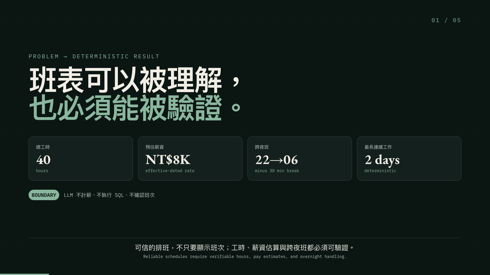
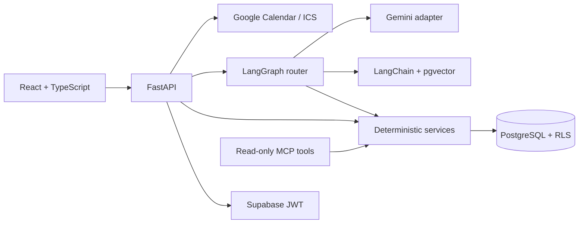

# ShiftMate Web

[](https://github.com/mieuxwei/shiftmate-web/actions/workflows/validate.yml)
[](LICENSE)

[繁體中文](#繁體中文) · [English](#english)

[互動 Demo / Interactive demo](https://shiftmate-web-fucvnupudq-de.a.run.app/#demo) ·
[2.5 分鐘影片 / Video](https://github.com/mieuxwei/shiftmate-web/releases/download/v1.0.0/shiftmate-demo.mp4) ·
[OpenAPI](https://shiftmate-web-fucvnupudq-de.a.run.app/docs) ·
[評估結果 / Evaluations](evals/reports/summary.md) ·
[系統架構 / Architecture](docs/architecture.md)



## 繁體中文

**一個以確定性程式為核心、由人類覆核 AI 結果，並為規章答案提供引用來源的排班助理。**

ShiftMate 協助輪班工作者將班表影像轉為可覆核的班次、核對工時與預估薪資，並根據有頁碼引用的工作規章回答問題。系統遵守一項核心原則：LLM 可以協助理解資料，但不能成為身分、薪資計算、SQL 或已確認班次寫入的事實來源。

### 兩分鐘體驗產品

公開 Demo 使用合成資料，不需帳號，也不會呼叫 Gemini、Google Calendar 或正式資料庫。

1. 核對跨夜班、實際工時與依生效日期套用的預估薪資。
2. 修正一筆有歧義的 AI 辨識候選資料，確認模型結果不會直接寫入。
3. 在「有明確引用」與「文件互相衝突而拒答」兩種規章狀態間切換。
4. 比較有班表與規章依據的問題，以及被系統拒絕的寫入要求。
5. 從履歷主張直接前往程式碼、API、測試與離線評估證據。

首頁另有響應式行事曆與儀表板的唯讀預覽。完整 CRUD 不透過共用公開帳號開放，以免混合不同訪客的資料與權限。

### 技術重點與可驗證證據

| 問題 | 實作方式 | 證據 |
| --- | --- | --- |
| AI 影像辨識可能出錯 | Gemini 結構化輸出先成為草稿，通過 schema validation 並由使用者逐筆確認後才能寫入 | [`imports` service](backend/app/services/imports.py)、[測試](backend/tests/test_import_service.py) |
| 工時與薪資必須可重算 | 時區、休息時間、跨夜班及生效日期費率皆由確定性 domain code 計算 | [`analytics` domain](backend/app/domain/analytics.py)、[測試](backend/tests/test_schedule_analytics.py) |
| 規章答案需要來源 | 以 owner-scoped pgvector 檢索、相關性門檻、文件頁碼與衝突拒答限制輸出 | [`retrieval` service](backend/app/services/retrieval.py)、[RAG 評估](evals/reports/rag.json) |
| 混合問題跨越信任邊界 | Stateless LangGraph route 先驗證班表事實與檢索證據，再組成答案 | [`assistant` graph](backend/app/services/assistant.py)、[路由案例](evals/routing/cases.json) |
| 多使用者資料必須隔離 | PostgreSQL forced RLS，加上非 owner、無 `BYPASSRLS` 的 runtime roles | [migrations](migrations)、[整合測試](backend/tests/integration/test_migrations_and_rls.py) |
| 外部整合可能失敗 | Calendar 同步採 idempotent event ID、refresh token 加密、有限重試及 ICS fallback | [`calendar` service](backend/app/services/calendar.py)、[失敗模式案例](evals/failure_modes/cases.json) |

### 品質證據，也保留失敗案例

離線評估由版本控制中的合成 fixtures 重建；失敗案例不會為了作品集數字而刪除：

- OCR：9 個案例，3 個可見 miss；日期 exact match 0.889、時間 exact match 0.778、review recall 0.80。
- RAG：5 個案例，1 個 conflict miss；Recall@k 0.90、citation correctness 1.00、groundedness 0.80、refusal accuracy 0.80。
- Routing：12 個問題，2 次保守 ambiguous fallback；accuracy 0.833。

這些是規模有限但可重現的方向性測試，不代表正式流量指標，也不表示系統已適合薪資、法律或人資決策。完整結果與逐案例原因請見[評估報告](evals/reports/summary.md)。

### 安全與營運邊界

- 公開範例、畫面、fixtures 與評估資料全部為合成資料。
- 瀏覽器不會收到 service-role key；一般請求使用登入者身分與資料庫 RLS。
- MCP 僅提供六個已驗證、owner-scoped、唯讀工具，不接受 owner ID 或 raw SQL。
- Calendar 使用 PKCE、最小化 `calendar.events.owned` scope、加密 refresh token、冪等 event ID 與 ICS fallback。
- GitHub Actions 透過 branch-restricted Workload Identity Federation 部署，不在 GitHub 儲存 service-account JSON key。
- Cloud Run 採 request-based CPU、min 0、max 1、512 MiB，並設置 quota 與 retention 控制；預期成本為 NT$0，但免費額度與供應商政策仍可能改變。

---

## English

**A deterministic-first shift assistant with human-reviewed AI, cited policy answers, and owner-isolated data.**

ShiftMate helps shift workers turn schedule images into reviewable shifts, check hours and estimated pay, and ask questions against cited workplace policies. It follows one core rule: an LLM may assist, but it never becomes the source of truth for identity, payroll calculations, SQL, or confirmed schedule writes.

### Try the product in two minutes

The public demo uses synthetic data. It requires no account and makes no Gemini, Google Calendar, or production-database call.

1. Verify an overnight shift, paid hours, and an effective-dated pay estimate.
2. Correct an ambiguous AI extraction candidate before it becomes confirmable.
3. Switch between a cited policy answer and a conflicting-document refusal.
4. Compare a grounded schedule-policy question with a rejected write request.
5. Follow each portfolio claim to code, API, tests, and offline evaluations.

The homepage also provides a read-only responsive calendar and dashboard preview. Full CRUD is intentionally not exposed through a shared public account, avoiding mixed visitor data and permissions.

### Technical decisions and evidence

| Problem | Implementation | Evidence |
| --- | --- | --- |
| AI extraction can be wrong | Gemini structured output enters a draft; schema validation and explicit row confirmation gate writes | [`imports` service](backend/app/services/imports.py), [tests](backend/tests/test_import_service.py) |
| Hours and pay must be reproducible | Timezone, breaks, overnight shifts, and effective-dated rates are calculated in deterministic domain code | [`analytics` domain](backend/app/domain/analytics.py), [tests](backend/tests/test_schedule_analytics.py) |
| Policy answers need provenance | Owner-scoped pgvector retrieval, relevance thresholds, page citations, and conflict refusal | [`retrieval` service](backend/app/services/retrieval.py), [RAG evaluation](evals/reports/rag.json) |
| Hybrid questions cross trust boundaries | A stateless LangGraph route validates deterministic schedule facts and retrieved evidence before composing an answer | [`assistant` graph](backend/app/services/assistant.py), [routing cases](evals/routing/cases.json) |
| Multi-user data must stay isolated | PostgreSQL forced RLS plus non-owner, non-`BYPASSRLS` runtime roles | [migrations](migrations), [integration tests](backend/tests/integration/test_migrations_and_rls.py) |
| Integrations fail unpredictably | Idempotent Calendar sync, encrypted refresh tokens, ICS fallback, bounded retries, and safe error states | [`calendar` service](backend/app/services/calendar.py), [failure-mode cases](evals/failure_modes/cases.json) |

### Quality evidence, including misses

The offline suite is rebuilt from versioned synthetic fixtures. Failures stay visible instead of being removed from the portfolio:

- OCR: 9 cases, 3 observed misses; date exact match 0.889, time exact match 0.778, review recall 0.80.
- RAG: 5 cases, 1 observed conflict miss; Recall@k 0.90, citation correctness 1.00, groundedness 0.80, refusal accuracy 0.80.
- Routing: 12 questions, 2 conservative ambiguous fallbacks; accuracy 0.833.

These are small, reproducible directional tests—not production traffic metrics or a claim of payroll, legal, or HR readiness. See the [generated report](evals/reports/summary.md) for case-level failure reasons.

### Security and operational boundaries

- Public examples, screenshots, fixtures, and evaluation inputs are synthetic.
- Browser clients never receive a service-role key; ordinary requests use the authenticated owner identity and database RLS.
- MCP exposes six authenticated, owner-scoped, read-only tools and accepts no owner ID or raw SQL argument.
- Calendar uses PKCE, the narrow `calendar.events.owned` scope, encrypted refresh tokens, idempotent event IDs, and an always-available ICS fallback.
- GitHub Actions deploys through branch-restricted Workload Identity Federation; no service-account JSON key is stored in GitHub.
- Cloud Run is bounded to request-based CPU, min 0, max 1, 512 MiB, with quotas and retention controls designed for expected NT$0 operation. Free-tier limits and provider policies can change.

---

## 系統架構 / Architecture



完整的 request boundary、ERD、LangGraph flow 與 owner isolation model 收錄於[架構文件](docs/architecture.md)。

The [architecture notes](docs/architecture.md) cover the full request boundary, ERD, LangGraph flow, and owner-isolation model.

## 本機執行 / Run locally

需求 / Requirements: Python 3.12, Node.js 24, pnpm 11.19, and Docker.

```bash
python3.12 -m venv .venv
source .venv/bin/activate
pip install -e ".[dev]"
corepack enable
pnpm --dir frontend install --frozen-lockfile
docker compose up --build
curl --fail http://localhost:8000/api/v1/health
```

開啟 <http://localhost:8000>。互動 Demo 與班表預覽不需要憑證；需登入的功能使用 [`.env.example`](.env.example) 所列的公開 Supabase URL 與 anon key。

Open <http://localhost:8000>. The interactive demo and schedule preview need no credentials; authenticated features use the public Supabase URL and anon key described in [`.env.example`](.env.example).

## 驗證 / Verify

```bash
ruff format --check .
ruff check .
mypy
pytest --cov=backend.app --cov-report=term-missing
python evals/run.py --check
pnpm --dir frontend format
pnpm --dir frontend lint
pnpm --dir frontend typecheck
pnpm --dir frontend test
pnpm --dir frontend build
docker build -t shiftmate-web:local .
```

PostgreSQL 整合測試設定請見 [migrations/README.md](migrations/README.md)。安全的 REST／MCP 範例位於 [docs/api-examples.md](docs/api-examples.md)，完整 transport 說明位於 [docs/mcp.md](docs/mcp.md)。

See the same files for disposable PostgreSQL integration setup, safe REST/MCP examples, and transport details.

## 專案結構 / Repository map

```text
backend/      FastAPI routes, domain/services, repositories, MCP, tests
frontend/     React/TypeScript product UI and credential-free demo
migrations/   PostgreSQL schema, roles, forced RLS, pgvector
evals/        Versioned synthetic OCR, RAG, routing, failure-mode cases
infra/        Bounded Cloud Run, IAM, Scheduler, and retention policies
docs/         Architecture, API examples, deployment, and design decisions
portfolio/    Reproducible source for the released 2.5-minute case-study video
```

## 設計取捨 / Deliberate trade-offs

- 這是 portfolio-grade reference implementation，不是正式薪資、法律、人資或就業決策系統；薪資永遠標示為預估。

  This is not a production payroll, legal, HR, or employment-decision system; pay is always labeled as an estimate.

- Process-local rate limiting 符合目前單一 instance 的部署限制；若水平擴充，必須改用 shared limiter。

  Process-local rate limiting matches the one-instance deployment; horizontal scaling would require a shared limiter.

- 正式 Gemini 與 Google Calendar 呼叫需要專案擁有者的 credentials；公開 Demo 使用 deterministic local fixtures，避免共用帳號、私人資料、不可預測模型輸出與非預期雲端成本。

  Live Gemini and Google Calendar calls require owner-configured credentials; the public demo uses deterministic local fixtures instead.

營運、rollback、emergency stop 與 teardown 詳見[部署文件](docs/deployment.md)。

Operational procedures, rollback, emergency stop, and teardown are documented in the [deployment guide](docs/deployment.md).

## 授權 / License

[MIT](LICENSE)
