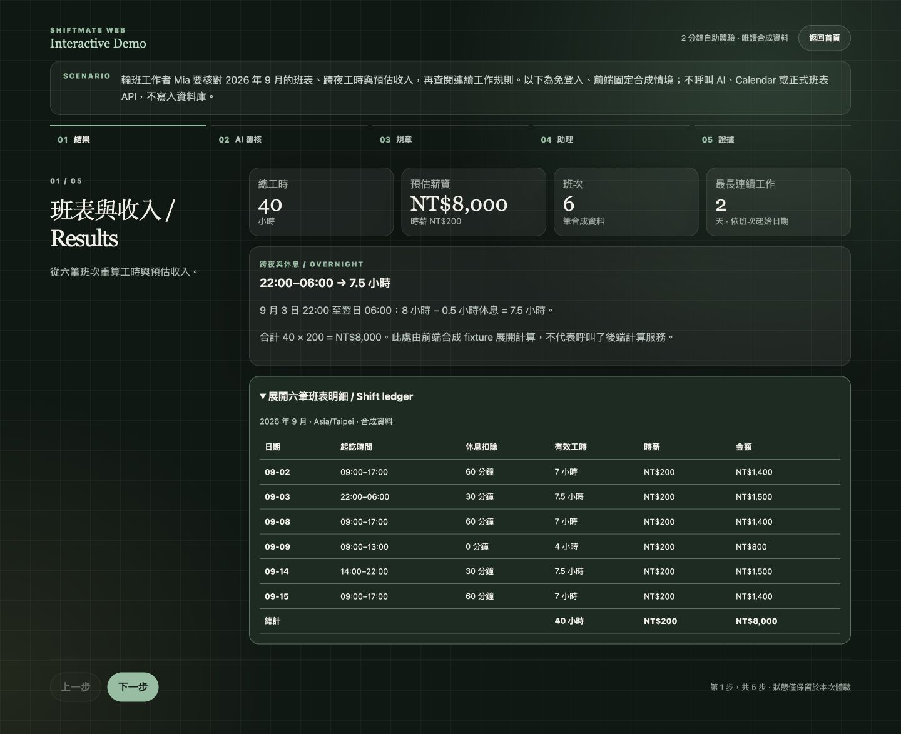
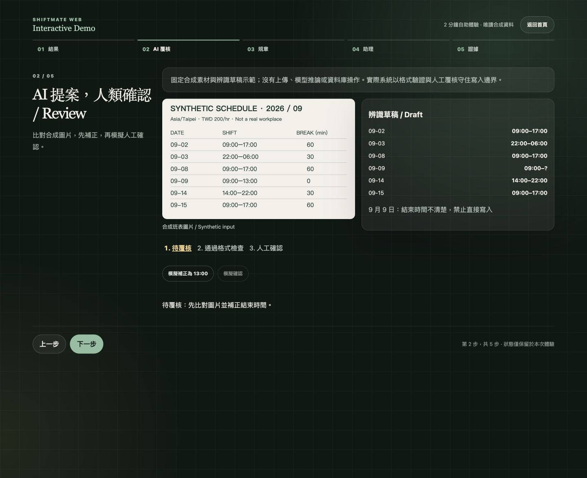
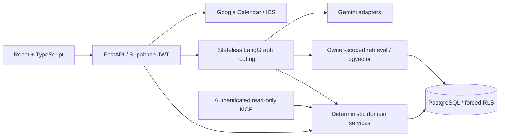

# ShiftMate Web

A shift assistant that turns schedule images into human-reviewed drafts, reproducible hours and pay estimates, and policy answers with sources.

**Independent AI Systems Project · v1.0.0 Released**

自主 AI 系統專案｜班表由人覆核、工時由程式計算、規章答案附來源。

[](https://github.com/mieuxwei/shiftmate-web/actions/workflows/validate.yml)
[](LICENSE)

[Live Demo](https://shiftmate-web-fucvnupudq-de.a.run.app/#demo) ·
[完整中文介紹](docs/project-overview.md) ·
[Architecture](docs/architecture.md) ·
[Evaluation report](evals/reports/summary.md) ·
[v1.0.0 release](https://github.com/mieuxwei/shiftmate-web/releases/tag/v1.0.0)

The existing release was published on September 3, 2026 at tag commit
`9691ba5`. The screenshots below show the interface in this source revision.
Presentation updates after the original tag are released through the
[deployment workflow](https://github.com/mieuxwei/shiftmate-web/actions/workflows/release.yml);
the hosted rollout may briefly lag the repository.

## Interface and outcomes





The implemented workflow separates AI suggestions from confirmed schedule data,
calculates hours and estimated pay in deterministic domain code, and exposes
policy sources and refusal boundaries. The public demo makes these boundaries
inspectable without a shared account or access to real schedules.

- Six synthetic shifts total **40 paid hours and NT$8,000 at NT$200/hour**.
- An overnight shift is **22:00–06:00, minus 30 minutes = 7.5 paid hours**.
- The longest consecutive work period is **2 days**, counted by shift start dates.
- A simulated correction and a separate human-confirmation action demonstrate the review boundary.

These numbers describe one fixed synthetic scenario, not measured productivity,
model accuracy, or production payroll performance.
The [shared fixture](frontend/src/demo/schedule-demo.json),
[presentation tests](frontend/tests/ReviewerShowcase.test.tsx), and
[domain consistency test](backend/tests/test_demo_fixture.py) make them traceable.

## Workflow and core capabilities

1. **Results:** inspect six shifts, breaks, hourly rates and totals.
2. **AI review:** compare a clearly labeled synthetic schedule image with a draft;
   correct September 9 to 09:00–13:00, then simulate confirmation.
3. **Policy:** inspect a sourced answer, or compare two contradictory synthetic
   policy versions and the resulting refusal.
4. **Assistant:** follow a simulated schedule–policy tool trace; a write request
   is refused and leaves the schedule unchanged.
5. **Evidence:** open implementation, integration tests and offline evaluation reports.

The demo is a bounded in-memory frontend simulation: no uploads, live AI,
Calendar calls, real schedule reads or writes. Navigation retains state;
“重新體驗” resets it. The homepage's API health indicator belongs to the optional
authenticated workspace and is not a prerequisite for the demo.
`#reviewer` remains an alias of `#demo`.

免登入 Demo 使用固定合成資料；真實整合需自行配置憑證。AI 補正與人工確認是不同狀態，不代表示範已寫入資料庫。

## Architecture and design decisions



The public five-step demo is separate from this authenticated system path.

| Design decision                                                                       | Implementation evidence                                                                                                                                                |
| ------------------------------------------------------------------------------------- | ---------------------------------------------------------------------------------------------------------------------------------------------------------------------- |
| AI output is a draft, never schedule truth without confirmation                       | [Import service](backend/app/services/imports.py), [tests](backend/tests/test_import_service.py)                                                                       |
| Timezone, overnight spans, breaks and effective-dated rates are deterministic         | [Analytics domain](backend/app/domain/analytics.py), [tests](backend/tests/test_schedule_analytics.py)                                                                 |
| Policy answers require owner-scoped evidence, citations and conflict handling         | [Retrieval service](backend/app/services/retrieval.py), [retrieval decision](docs/decisions/0003-owner-scoped-policy-retrieval.md)                                     |
| LangGraph combines schedule facts and policy evidence; unsupported writes are refused | [Assistant service](backend/app/services/assistant.py), [tests](backend/tests/test_assistant_service.py)                                                               |
| Isolation is enforced in PostgreSQL, not inferred by the model                        | [Roles and pooling](docs/decisions/0002-database-roles-and-pooling.md), [RLS tests](backend/tests/integration/test_migrations_and_rls.py)                              |
| Integrations have explicit failure paths                                              | [Calendar OAuth/idempotency](docs/decisions/0004-calendar-oauth-and-idempotency.md), [failure tests](backend/tests/test_calendar_service.py), [MCP tools](docs/mcp.md) |

Stack: React, TypeScript, Vite; Python/FastAPI, SQLAlchemy, Alembic;
Gemini structured output, LangChain, LangGraph; Supabase Auth, PostgreSQL,
pgvector and RLS; Google Calendar and MCP; Docker, GitHub Actions and Cloud Run.
See [architecture](docs/architecture.md), [frontend dependencies](frontend/package.json)
and [backend dependencies](pyproject.toml).

## Validation, sample scope and limitations

The [offline report](evals/reports/summary.md) is generated by
`python evals/run.py` from versioned synthetic fixtures, without network or a live model.
The presentation changes do not modify evaluation inputs or historical results.

| Evaluation | Sample and method                                                       | Result                                                                                            | Known failures / limits                                                                                                                             |
| ---------- | ----------------------------------------------------------------------- | ------------------------------------------------------------------------------------------------- | --------------------------------------------------------------------------------------------------------------------------------------------------- |
| OCR        | 9 synthetic structured-output cases; positional exact-match comparison  | Date 0.889; time 0.778; review recall 0.80; 3 failed cases                                        | `skewed`: wrong time; `multiple-dates`: missing shift; `illegible`: missed review flag. Not an image-decoding benchmark; ordering affects matching. |
| RAG        | 5 synthetic retrieval/answer cases; versioned human groundedness labels | Recall@k 0.90; citation correctness 1.00; groundedness 0.80; refusal accuracy 0.80; 1 failed case | `conflicting-overtime`: retrieval miss, ungrounded answer, refusal error. Fixture latency is not live provider performance.                         |
| Routing    | 12 synthetic questions; expected label versus deterministic router      | Accuracy and deterministic coverage 0.833; 2 ambiguous fallbacks                                  | `terse-leave`, `terse-week`. Optional Gemini fallback accuracy is not measured.                                                                     |

小樣本合成評估僅是可重現的方向性證據，不代表真實流量的普遍準確率。Demo 成功拒答的固定情境也不會抵銷歷史評估中的失敗。

This is not a production payroll, legal or HR decision system. Pay is an estimate.
PDF variety and terse queries remain limitations. Process-local rate limiting
matches the single-instance deployment configuration; scaling requires a shared
limiter. Live integrations require owner-configured credentials. Provider
availability and cost are not guaranteed by offline failure-injection tests.

## Run locally and explore further

For the credential-free presentation only, use Node.js 24 and pnpm 11.19:

```bash
pnpm --dir frontend install --frozen-lockfile
pnpm --dir frontend dev --host 127.0.0.1
```

Open the Vite URL printed by the command, then append `/#demo`.
An unavailable health endpoint does not block the synthetic tour.

For the full system, additionally use Python 3.12 and Docker:

```bash
python3.12 -m venv .venv
source .venv/bin/activate
pip install -e ".[dev]"
docker compose up --build
```

Configure authentication and optional integrations using [environment examples](.env.example).
Never publish shared credentials. See [deployment](docs/deployment.md) before
changing production settings: the main CI/CD path can run migrations and deploy Cloud Run.

```bash
pnpm --dir frontend format
pnpm --dir frontend lint
pnpm --dir frontend typecheck
pnpm --dir frontend test
pnpm --dir frontend build
pytest backend/tests/test_demo_fixture.py backend/tests/test_schedule_analytics.py
python evals/run.py --check
```

[Full Chinese overview](docs/project-overview.md) · [Demo guide](docs/demo-script.md) ·
[API examples](docs/api-examples.md) · [MCP](docs/mcp.md) ·
[Disposable database integration setup](migrations/README.md) ·
[Synthetic data policy](docs/synthetic-data-policy.md)

## License

[MIT](LICENSE)
