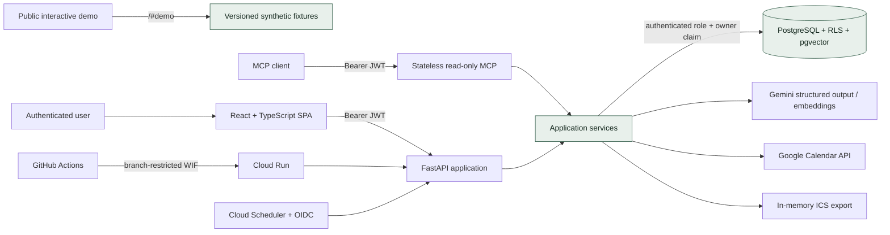
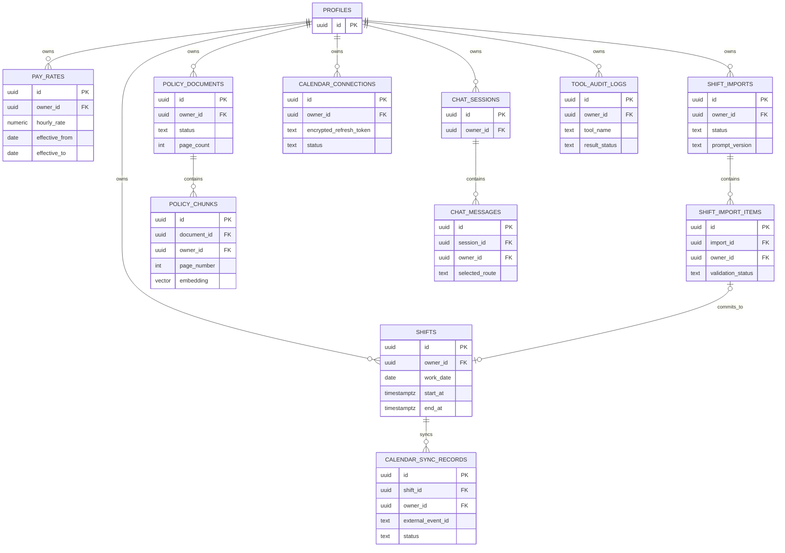
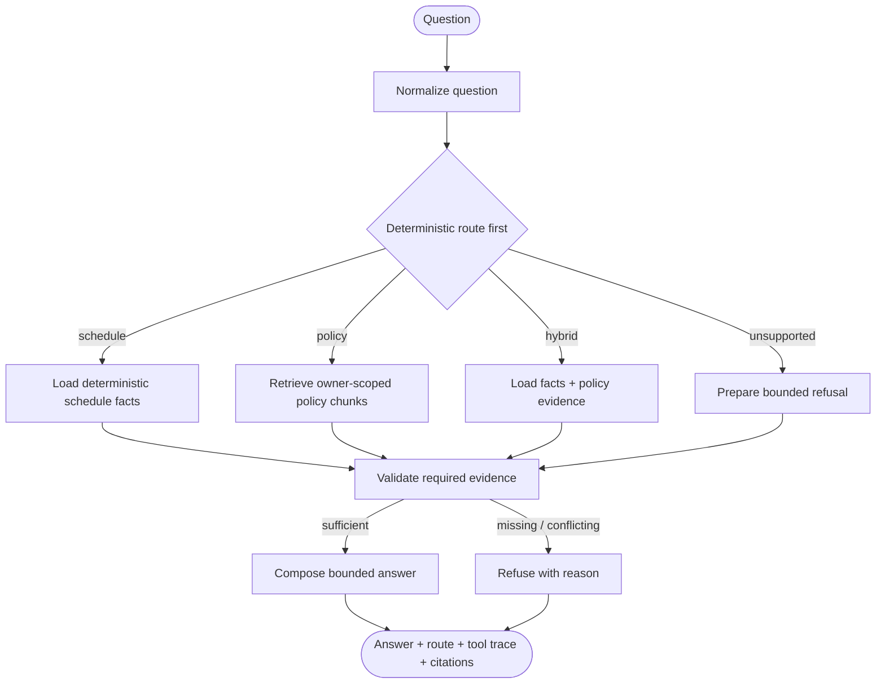

# Architecture and evidence map

ShiftMate keeps language-model output outside the system of record. Identity,
calculation, authorization, validation, and confirmed writes remain deterministic.
The public interactive demo is an additional static path: it reads only versioned
synthetic fixtures bundled into the frontend.

## System architecture

Key boundaries:

- The demo route never signs in, fetches production data, calls Gemini or
  Calendar, or exposes a write control.
- FastAPI verifies Supabase identity; PostgreSQL RLS derives the owner from the
  request transaction. Ordinary traffic does not use a service-role key.
- Gemini can propose import candidates or compose grounded text. It cannot
  execute SQL, calculate payroll, or confirm a shift.
- Calendar sync is optional and idempotent. ICS export remains available without
  OAuth and never writes to Google Calendar.
- GitHub deploys through Workload Identity Federation; no service-account JSON
  key is stored in the repository or GitHub.

## Data model

The diagram focuses on relationships relevant to the product. Every owner table
is protected by forced RLS; `scheduled_job_runs` is maintenance-only.

## LangGraph assistant

The graph is stateless and has no checkpointer. Schedule totals, pay estimates,
and consecutive-day counts come from deterministic services. Policy citations
are assembled from stored document, chunk, and page metadata rather than
invented by a model.

## Deployment and removal

Production is a single container in Cloud Run (`min 0`, `max 1`, request-based
CPU, 512 MiB) backed by the existing Supabase PostgreSQL project. The complete
resource inventory, migration path, rollback procedure, emergency stop, and
ordered teardown are documented in [deployment.md](deployment.md). No automatic
database downgrade is performed during rollback.
